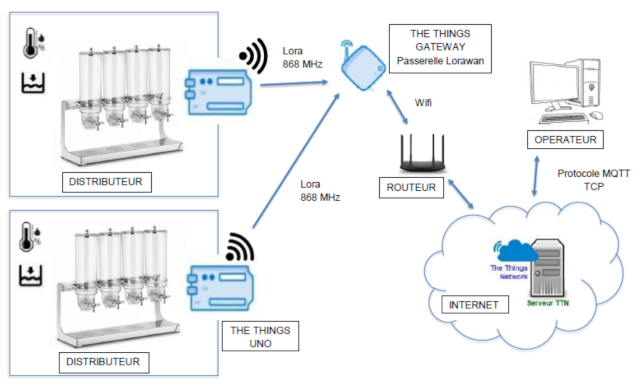
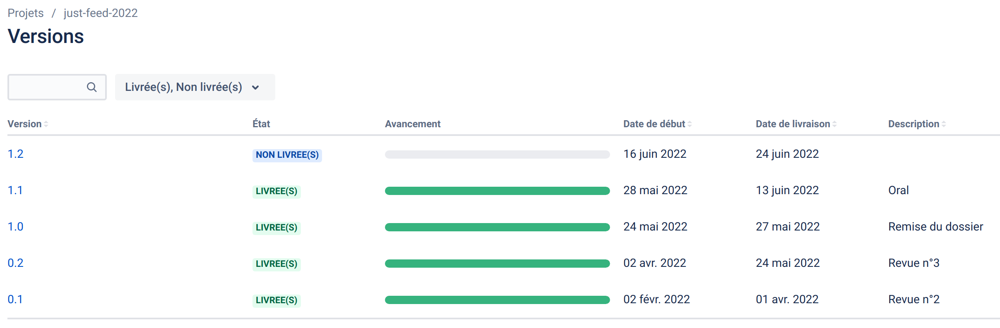
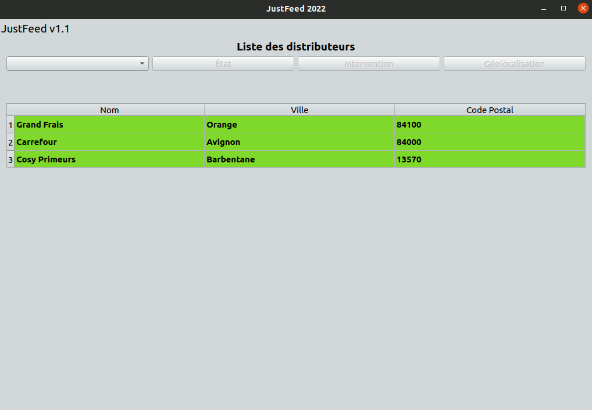
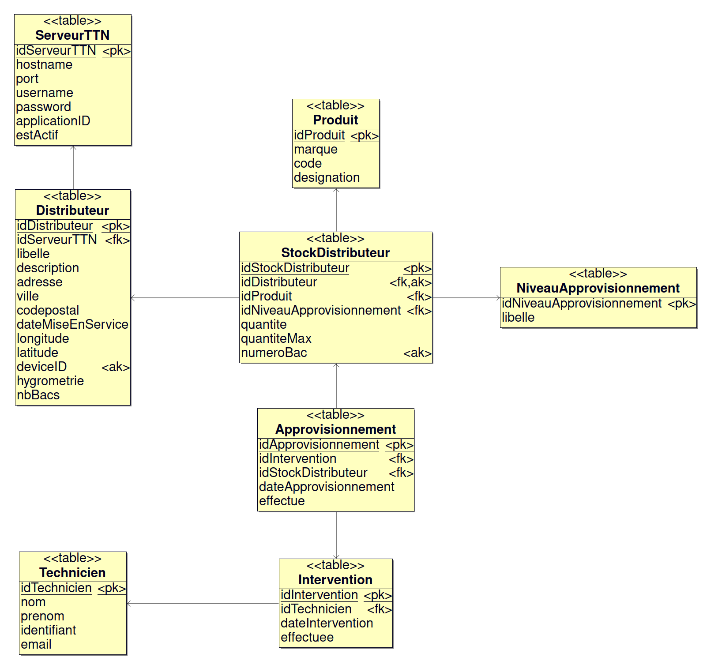

# Le projet just-feed 2022

Le système doit permettre de surveiller à distance des distributeurs automatiques (fruits secs, pâtes, riz,...) afin d’optimiser le processus de réapprovisionnement.

- [Le projet just-feed 2022](#le-projet-just-feed-2022)
  - [Expression du besoin](#expression-du-besoin)
  - [Auteur](#auteur)
  - [Historique des versions](#historique-des-versions)
  - [Fonctionnalités](#fonctionnalités)
  - [TODO](#todo)
  - [Resources logicielles](#resources-logicielles)
  - [Documentation du code](#documentation-du-code)
  - [Base de données](#base-de-données)
  - [Kanban](#kanban)
  - [Qt MQTT](#qt-mqtt)

## Expression du besoin

Système de surveillance à distance de distributeurs automatiques permettant de :

- Envoyer des alertes lorsque le distributeur doit être réapprovisionné
- Signaler la nécessité de mettre en oeuvre des opérations de maintenance prédictive
- Superviser l’ensemble des distributeurs à partir d’une application



## Auteur

- Laura MORELLO <<lauramorello1604@gmail.com>>

## Historique des versions

- [Version 1.1](https://github.com/btssn-lasalle-84/just-feed-2022/releases/tag/1.1) : 24/05/2022
- [Version 1.0](https://github.com/btssn-lasalle-84/just-feed-2022/releases/tag/1.0) : 27/05/2022
- [Version 0.2](https://github.com/btssn-lasalle-84/just-feed-2022/releases/tag/0.2) : 24/05/2022
- [Version 0.1](https://github.com/btssn-lasalle-84/just-feed-2022/releases/tag/0.1) : 02/04/2022



## Fonctionnalités

- Lister les distributeurs
- Communiquer avec les distributeurs en MQTT
- Visualiser l’état d’un distributeur
- Géolocaliser sur une carte un distributeur, afficher ses coordonnées et adresse



## TODO

- [ ] Sélectionner un distributeur pour une intervention
- [ ] Définir une intervention (type d’intervention, nombre de  distributeurs à visiter, type de produits à réapprovisionner)

## Resources logicielles

| Désignation  | Caractéristiques |
| ------------ |:----------------:|
| OS Poste de développement | PC sous GNU/Linux Ubuntu 20.04       |
| EDI                       | Qt Creator 4.11.0                    |
| Développement             | Qt 5.12.8 / C++ (GCC 9.3.0, 64 bits) |

## Documentation du code

https://btssn-lasalle-84.github.io/just-feed-2022/

## Base de données



## Kanban

[just-feed-2022](https://github.com/btssn-lasalle-84/just-feed-2022/projects/1)

## Qt MQTT

[Qt MQTT](https://doc.qt.io/QtMQTT/index.html) fournit une implémentation conforme à la norme MQTT.

Qt MQTT fait parti de [Qt For Automation](http://doc.qt.io/QtForAutomation/qtautomation-overview.html) et pas directement de Qt. Il faut donc l'installer.

1. Identifier la version de Qt :

```sh
$ qmake -v
QMake version 3.1
Using Qt version 5.12.8 in /usr/lib/x86_64-linux-gnu
```

Ici, la version de Qt est `5.12.8`.

2. Récupérer le code source du module `mqtt` en clonant le dépôt git

```sh
$ sudo git clone https://code.qt.io/qt/qtmqtt.git
$ cd qtmqtt/
```

3. Sélectionner la branche qui correspond à la version de Qt utilisée

```sh
$ sudo git checkout 5.12.8
```

4. Installer le paquet fournissant les fichiers d'en-tête de développement indépendants 

```sh
$ sudo apt install qtbase5-private-dev
```

5. Fabriquer et installer le module `mqtt`

```sh
$ sudo qmake

$ sudo make

$ sudo make install
```

Pour accèder aux classes du module Qt MQTT, il faudra ajouter le module `mqtt` au fichier de projet `.pro` :

```
QT += mqtt
```

©️ LaSalle Avignon 2022
